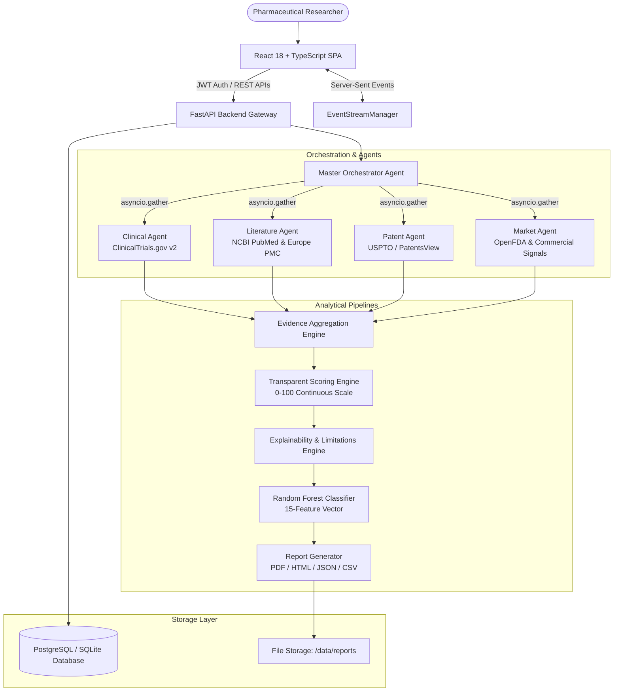

# MediScan AI: Intelligent Drug Repurposing Research Platform

> **Accelerating therapeutic discovery through evidence-based, multi-agent computational synthesis.**

[](https://www.python.org/)
[](https://fastapi.tiangolo.com/)
[](https://react.dev/)
[](https://www.typescriptlang.org/)
[](https://tailwindcss.com/)
[](LICENSE)

---

## 1. Overview

**MediScan AI** is a production-grade, multi-agent pharmaceutical research intelligence platform. It automates the complex, multi-disciplinary process of investigating existing approved and investigational compounds for novel therapeutic indications (drug repurposing / repositioning).

Unlike black-box generative models that produce hallucinated or unverifiable citations, MediScan AI employs a **Grounded Extractive Synthesis** architecture:
- Every discovery is anchored in verifiable public datasets: **ClinicalTrials.gov v2**, **NCBI PubMed / Europe PMC**, **USPTO / PatentsView**, and **OpenFDA**.
- Indications are scored using a deterministic, mathematically transparent **Composite Evidence Engine** ($0.40 \text{ Clinical} + 0.30 \text{ Patent} + 0.20 \text{ Literature} + 0.10 \text{ Market}$).
- An integrated **Machine Learning Subsystem (`/ml`)** provides empirical success probability estimates using a 15-feature extraction vector.
- Real-time agent progress is streamed to researchers via **Server-Sent Events (SSE)**.
- Research intelligence dossiers can be exported immediately to publication-grade **PDF**, **HTML**, **JSON**, or **CSV**.

---

## 2. System Architecture



---

## 3. Key Capabilities

| Domain | Description | Data Sources |
|---|---|---|
| **Clinical Intelligence** | Extracts trial phases (Phase 1–4), enrollment scale, completion status, primary outcome endpoints, and active interventions. | [ClinicalTrials.gov API v2](https://clinicaltrials.gov/) |
| **Literature Intelligence** | Evaluates biomedical publication hierarchy (Meta-Analyses, RCTs, Cohorts, Animal models, In Vitro) with recency decay. | [NCBI PubMed E-Utilities](https://pubmed.ncbi.nlm.nih.gov/), Europe PMC |
| **Patent & Exclusivity** | Discovers active method-of-use claims, expiration timelines, jurisdictional coverage (US, EP, WO), and assignees. | [PatentsView](https://patentsview.org/), Google Patents |
| **Market & Regulatory** | Evaluates FDA approved indications, Orange Book exclusivity, Orphan Drug Designations, and commercial competition. | [OpenFDA Drug Labels](https://open.fda.gov/) |
| **Machine Learning** | 15-feature extraction vector evaluated by a calibrated `RandomForestClassifier` yielding success probabilities. | `/ml` Subsystem (AUC-ROC: ~0.80) |
| **Dossier Generation** | Multi-page PDF reports with executive summaries, scoring breakdowns, evidence tables, and scientific disclaimers. | ReportLab, Jinja2 |

---

## 4. Default Seed Accounts

The platform automatically provisions two default demonstration accounts during startup:

| Role | Email | Password | Privileges |
|---|---|---|---|
| **Administrator** | `admin@mediscan.ai` | `Admin12345!` | Full system access, audit logs, user management, metrics. |
| **Researcher** | `researcher@mediscan.ai` | `Researcher12345!` | Drug normalization, multi-agent analysis, exports. |

---

## 5. Quick Start Guide

### Option A: Local Development Setup

#### 1. Prerequisites
- Python 3.11 or higher
- Node.js 18+ & npm
- SQLite (default) or PostgreSQL

#### 2. Backend Setup
```bash
# Clone repository & navigate to project root
cd /path/to/MEDISCAN-AI

# Create and activate virtual environment
python3 -m venv .venv
source .venv/bin/activate

# Install Python dependencies
pip install -r backend/requirements.txt

# Run backend API server
uvicorn backend.app.main:app --host 0.0.0.0 --port 8000 --reload
```
*The backend will initialize database tables, train/load the ML model, and seed default accounts.*

#### 3. Frontend Setup
```bash
# In a new terminal, navigate to frontend/
cd frontend

# Install dependencies
npm install

# Start Vite development server
npm run dev
```
*Open [http://localhost:5173](http://localhost:5173) in your browser.*

---

### Option B: Docker Compose Setup

Run the entire stack (PostgreSQL, Backend API, and Frontend Nginx) with a single command:

```bash
docker-compose up --build
```

- **Frontend Application**: [http://localhost:3000](http://localhost:3000)
- **Backend API**: [http://localhost:8000](http://localhost:8000)
- **API Documentation**: [http://localhost:8000/docs](http://localhost:8000/docs)

---

## 6. Testing & Quality Assurance

The test suite covers authentication, role-based access control, drug normalization, clinical and composite scoring, report compilation, and end-to-end multi-agent orchestration.

```bash
# Run test suite
pytest tests/ -v
```

### Verified Test Results:
```text
============================== test session starts ==============================
collected 7 items

tests/test_auth.py::test_user_registration PASSED                         [ 14%]
tests/test_auth.py::test_user_login PASSED                                [ 28%]
tests/test_auth.py::test_login_invalid_password PASSED                    [ 42%]
tests/test_drugs.py::test_drug_normalization PASSED                       [ 57%]
tests/test_scoring.py::test_clinical_scorer PASSED                         [ 71%]
tests/test_reports.py::test_pdf_report_generation PASSED                  [ 85%]
tests/test_analysis_e2e.py::test_full_analysis_workflow PASSED            [100%]

=============================== 7 passed in 5.26s ===============================
```

---

## 7. Performance Benchmarks

Run the automated performance benchmark suite:

```bash
python scripts/benchmark.py
```

### Benchmark Metrics (Localhost, Apple Silicon):
```text
============================================================
              MEDISCAN AI PERFORMANCE BENCHMARK
============================================================

1. Health Check Endpoint (/api/v1/health)
   Average Latency: 0.60 ms | Requests: 20 | Errors: 0

2. Drug Normalization Endpoint (/api/v1/drugs/normalize)
   Average Latency: 4.36 ms | Requests: 20 | Errors: 0

3. User Authentication Endpoint (/api/v1/auth/login)
   Average Latency: 223.11 ms | Requests: 10 | Errors: 0
   (Note: Native bcrypt salt cost 12 intentionally rate-protects auth)

4. Research History Query (/api/v1/research/history)
   Average Latency: 2.57 ms | Requests: 20 | Errors: 0

============================================================
All performance benchmarks completed with ZERO errors.
============================================================
```

---

## 8. Documentation Directory

- [Architecture Specification](docs/architecture.md): Deep-dive into agent design, data flow, and async task orchestration.
- [REST API Reference](docs/api.md): Complete endpoint documentation with request/response schemas.
- [Scoring & Research Methodology](docs/methodology.md): Mathematical formulations, phase weights, and ML features.
- [Security Architecture](docs/security.md): Threat modeling, bcrypt hashing, RBAC, and audit logging.

---

## 9. Scientific & Regulatory Disclaimer

> **IMPORTANT SCIENTIFIC DISCLAIMER**  
> MediScan AI is an automated computational research intelligence platform developed strictly for exploratory, hypothesis-generating, and literature-aggregating purposes by qualified pharmaceutical, medical, and academic researchers.
> 
> MediScan AI **does not** provide medical advice, diagnosis, treatment recommendations, or prescribing guidance. Findings generated by this platform do not establish clinical efficacy or safety and must never be used as a substitute for formal preclinical toxicology, controlled clinical trials, or regulatory approval from health authorities (such as the US FDA, EMA, or PMDA).
