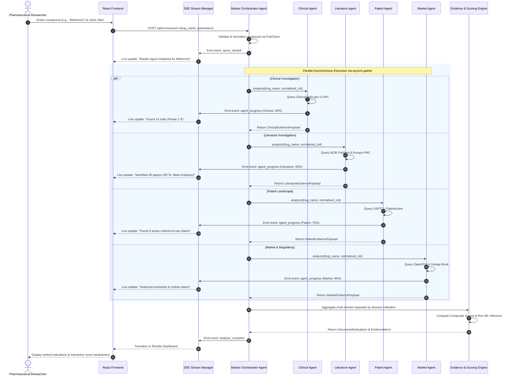
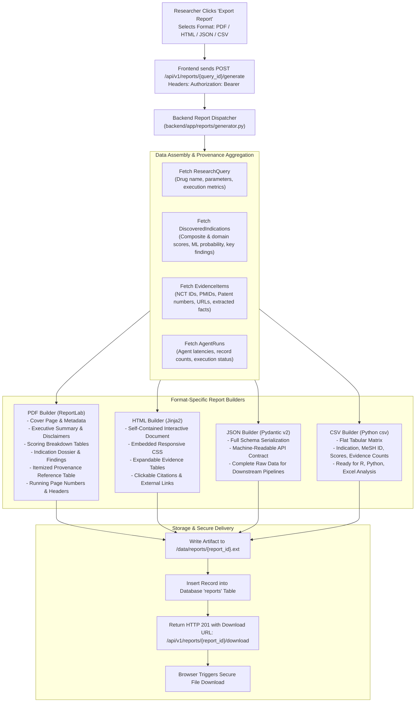

# MediScan AI: Architectural & Workflow Specifications

This document provides detailed diagrams and specifications for **MediScan AI: Intelligent Drug Repurposing Research Platform**, covering overall architecture, multi-agent orchestration, research pipelines, scoring integration, user interfaces, report generation, and system data flows.

---

## Figure 1 – Overall System Architecture

Shows the main architecture of MediScan AI, including the researcher interface, Master Agent, specialized AI agents, external research data sources, evidence-processing layer, and final research outputs.

```mermaid
flowchart TD
    subgraph ClientLayer["1. Researcher Interface (React 18 + TypeScript)"]
        UI_Search["Compound Search & Autocomplete"]
        UI_Live["Real-Time SSE Stream Visualizer"]
        UI_Dashboard["Repurposing Results Dashboard"]
        UI_Evidence["Itemized Evidence Modal"]
        UI_Export["Multi-Format Export Controls"]
    end

    subgraph GatewayLayer["2. Backend Gateway & Security (FastAPI)"]
        API_Gateway["API Router & Endpoint Gateway"]
        Auth_RBAC["Authentication & RBAC (JWT / Bcrypt)"]
        Audit_Logger["Tamper-Evident Security Audit Logger"]
        SSE_Manager["EventStreamManager (SSE Broadcast)"]
    end

    subgraph AgentLayer["3. Multi-Agent Orchestration Layer"]
        MasterAgent["Master Orchestrator Agent"]
        ClinicalAgent["Clinical Agent"]
        LitAgent["Literature Agent"]
        PatentAgent["Patent Agent"]
        MarketAgent["Market Agent"]
    end

    subgraph ExternalSources["4. External Research Data Repositories"]
        CT_Gov[("ClinicalTrials.gov API v2\n(Phases, Endpoints, Cohorts)")]
        NCBI[("NCBI PubMed & Europe PMC\n(Study Hierarchy, PMIDs)")]
        USPTO[("USPTO & PatentsView\n(Claims, Expirations, Assignees)")]
        OpenFDA[("OpenFDA & Orange Book\n(Labels, Exclusivity, Orphan)")]
        PubChem[("PubChem PUG-REST\n(CID, SMILES, Formula)")]
    end

    subgraph ProcessingLayer["5. Evidence-Processing & ML Layer"]
        EvidenceEngine["Evidence Aggregation Engine"]
        ScoringEngine["Deterministic Scoring Engine (0-100)"]
        ExplainEngine["Explainability & Limitations Engine"]
        ML_Model["ML Subsystem (RandomForestClassifier, 15 Features)"]
    end

    subgraph PersistenceLayer["6. Persistence & Storage Layer"]
        DB[("PostgreSQL / SQLite Database\n(Users, Queries, Evidence, Logs)")]
        FileStore[("File Storage: /data/reports\n(PDF, HTML, JSON, CSV)")]
    end

    subgraph OutputLayer["7. Final Research Output"]
        Out_PDF["Publication-Grade PDF Dossiers"]
        Out_HTML["Standalone Interactive HTML Reports"]
        Out_JSON["Structured Machine-Readable JSON"]
        Out_CSV["Tabular Indication & Score CSV"]
    end

    %% Connections
    ClientLayer <-->|REST APIs / Bearer JWT| GatewayLayer
    ClientLayer <-->|Server-Sent Events (SSE)| SSE_Manager
    GatewayLayer --> MasterAgent
    MasterAgent <-->|Normalization| PubChem
    MasterAgent -->|Parallel Dispatch| ClinicalAgent
    MasterAgent -->|Parallel Dispatch| LitAgent
    MasterAgent -->|Parallel Dispatch| PatentAgent
    MasterAgent -->|Parallel Dispatch| MarketAgent

    ClinicalAgent <-->|Async REST| CT_Gov
    LitAgent <-->|Async REST| NCBI
    PatentAgent <-->|Async REST| USPTO
    MarketAgent <-->|Async REST| OpenFDA

    ClinicalAgent & LitAgent & PatentAgent & MarketAgent --> EvidenceEngine
    EvidenceEngine --> ScoringEngine
    ScoringEngine --> ExplainEngine
    ExplainEngine --> ML_Model
    ML_Model --> GatewayLayer

    GatewayLayer --> DB
    GatewayLayer --> FileStore
    FileStore --> OutputLayer
```

---

## Figure 2 – Multi-Agent Workflow

Illustrates how the Master Agent receives a research request and distributes the work among the Clinical, Literature, Patent, and Market Agents for parallel analysis.



---

## Figure 3 – Drug Research Workflow

Shows the step-by-step process starting from drug entry and validation, followed by data collection, evidence analysis, indication identification, scoring, and generation of the final research results.

```mermaid
flowchart TD
    Step1["Step 1: Drug Entry & Validation\n- Researcher inputs compound name or trade name\n- Normalization via PubChem PUG-REST (CID, SMILES, Formula)\n- Extraction of existing approved indications"]
    --> Step2["Step 2: Research Scoping & Parameterization\n- Select target therapeutic area (optional) or open discovery\n- Configure minimum trial phase (e.g., Phase 2+) and study types"]
    --> Step3["Step 3: Concurrent Multi-Domain Data Collection\n- ClinicalTrials.gov v2: Interventional & observational studies\n- NCBI PubMed: Meta-analyses, RCTs, cohort, preclinical papers\n- USPTO / PatentsView: Method-of-use claims & expiry dates\n- OpenFDA: Approved labels, exclusivity, orphan designations"]
    --> Step4["Step 4: Evidence Extraction & Provenance Normalization\n- Fact extraction (enrollment, primary endpoints, completion status)\n- Source provenance anchoring (NCT IDs, PMIDs, Patent numbers)\n- Negative signal tagging (terminated trials, adverse events)"]
    --> Step5["Step 5: Indication Clustering & Identification\n- Disease entity normalization via MeSH & ICD terms\n- Cross-domain aggregation of all evidence per indication candidate"]
    --> Step6["Step 6: Transparent Evidence Scoring & ML Probability\n- Calculate Clinical (40%), Patent (30%), Literature (20%), Market (10%)\n- Compute 0-100 Composite Score\n- Extract 15-feature vector and evaluate RandomForestClassifier\n- Assign Confidence Tier (High >=70, Moderate 45-69, Exploratory <45)"]
    --> Step7["Step 7: Explainability & Limitations Generation\n- Identify key positive driving factors\n- Document negative signals, missing trial phases, and caveats\n- Synthesize grounded narrative summary (zero hallucinations)"]
    --> Step8["Step 8: Persistence & Interactive Visualization\n- Commit results, indications, and evidence to database\n- Render interactive results cards, score radar, and evidence modal\n- Enable instant export to PDF, HTML, JSON, and CSV"]
```



---

## Figure 4 – Evidence Integration and Scoring

Illustrates how information collected from different sources is combined and evaluated to produce an evidence-based assessment for each identified therapeutic indication.

```mermaid
flowchart TD
    subgraph Inputs["Multi-Domain Evidence Inputs"]
        In_Clin["Clinical Trials\n- Study Phase (Ph 1-4)\n- Status (Completed / Recruiting)\n- Enrollment Cohort Size\n- Primary Endpoint Definition"]
        In_Pat["Patent Landscape\n- Method-of-Use Claims\n- Remaining Term to Expiry\n- Multi-Jurisdiction (US/EP/WO)\n- Assignee Types"]
        In_Lit["Biomedical Literature\n- Study Hierarchy (Meta/RCT/In Vivo)\n- Journal Impact & Recency Decay\n- Mechanistic Confirmation\n- Cohort Scale"]
        In_Mkt["Market & Regulatory\n- Orphan Drug Designation\n- Unmet Medical Need Level\n- Generic vs Exclusivity Status\n- Class Competition Density"]
    end

    subgraph DomainScores["Domain Scoring Formulations"]
        S_Clin["Clinical Score (S_clinical)\nWeight: 0.40 (40%)\nScale: 0.0 - 100.0"]
        S_Pat["Patent Score (S_patent)\nWeight: 0.30 (30%)\nScale: 0.0 - 100.0"]
        S_Lit["Literature Score (S_literature)\nWeight: 0.20 (20%)\nScale: 0.0 - 100.0"]
        S_Mkt["Market Score (S_market)\nWeight: 0.10 (10%)\nScale: 0.0 - 100.0"]
    end

    In_Clin -->|Phase Weights * Status * ln(Enrollment)| S_Clin
    In_Pat -->|Claim Scope + Term + Jurisdictions| S_Pat
    In_Lit -->|Study Design Weight * Recency Multiplier| S_Lit
    In_Mkt -->|Orphan Status + Unmet Need + Exclusivity| S_Mkt

    subgraph Aggregation["Composite Scoring Formula"]
        Formula["S_composite = 0.40 * S_clinical + 0.30 * S_patent + 0.20 * S_literature + 0.10 * S_market\nContinuous Range: 0.0 to 100.0"]
    end

    S_Clin & S_Pat & S_Lit & S_Mkt --> Formula

    subgraph Evaluation["Dual Assessment Pipelines"]
        subgraph Tiers["Deterministic Confidence Tiers"]
            T_High["HIGH CONFIDENCE (Score >= 70.0)\nPhase 2/3 confirmation + robust literature + active IP"]
            T_Mod["MODERATE CONFIDENCE (Score 45.0 - 69.9)\nEarly Phase 1 + preclinical in vivo + emerging data"]
            T_Exp["EXPLORATORY (Score < 45.0)\nIn vitro assays + retrospective associations only"]
        end

        subgraph ML["Machine Learning Subsystem (/ml)"]
            ML_Pipe["15-Dimensional Feature Extraction Vector"]
            --> ML_Model["Calibrated RandomForestClassifier (AUC-ROC ~0.80)"]
            --> ML_Prob["Predicted Repurposing Probability (0.00 - 1.00)"]
        end
    end

    Formula --> Tiers
    Formula --> ML
```

---

## Figure 5 – Research Results Interface

Shows the researcher-facing interface where identified therapeutic areas, supporting evidence, scores, explanations, and source information are presented.

```
+---------------------------------------------------------------------------------------------------------+
|  [Pill] MEDISCAN AI   |  Dashboard   [+ New Analysis]   History   Methodology   Admin   |  Dr. Vance (v)|
+---------------------------------------------------------------------------------------------------------+
|  < Back to Dashboard                                              [ PDF Export ] [ HTML ] [ JSON ] [ CSV]|
|                                                                                                         |
|  COMPOUND RESEARCH DOSSIER                                                                              |
|  Metformin (CID: 4091) | SMILES: CN(C)C(=N)NC(=N)N | Class: Biguanide Antidiabetic                      |
|  Execution: 4.25s | Agents: 4/4 Completed | Total Evidence Items: 53 | Status: [ COMPLETED ]            |
+---------------------------------------------------------------------------------------------------------+
|  [!] MANDATORY SCIENTIFIC DISCLAIMER: For hypothesis-generation and preclinical research only.          |
|      Outputs do not establish clinical efficacy or safety. Not for clinical or diagnostic use.          |
+---------------------------------------------------------------------------------------------------------+
|  EXECUTIVE REPURPOSING SUMMARY                                                                          |
|  MediScan AI identified strong repositioning signals for Metformin across Oncology and Neurodegenerative |
|  indications, driven by 14 clinical trials, 28 publications, and active method-of-use filings.          |
+---------------------------------------------------------------------------------------------------------+
|  IDENTIFIED THERAPEUTIC INDICATIONS (RANKED BY COMPOSITE SCORE)                                         |
|                                                                                                         |
|  +---------------------------------------------------------------------------------------------------+  |
|  | #1 Colorectal Cancer (MeSH: D015179)                       [ HIGH CONFIDENCE ]  SCORE: 78.4 / 100 |  |
|  | ML Success Probability: 82.4% (Random Forest Model)        Evidence Records: 14                   |  |
|  |                                                                                                   |  |
|  | [ Score Breakdown ]                                                                               |  |
|  | Clinical (40%):   [=======================>    ] 82.5 / 100  (Phase 2 Completed, N=120)           |  |
|  | Patent (30%):     [================>           ] 65.0 / 100  (Active Method-of-Use Claims, US/EP) |  |
|  | Literature (20%): [=========================>  ] 88.0 / 100  (2 Meta-Analyses, 6 RCTs)            |  |
|  | Market (10%):     [===================>        ] 72.0 / 100  (High Unmet Need, Generic Base)      |  |
|  |                                                                                                   |  |
|  | Key Evidentiary Findings:                                                                         |  |
|  | - Completed Phase 2 randomized study demonstrated significant reduction in aberrant crypt foci.   |  |
|  | - Multiple peer-reviewed meta-analyses correlate metformin use with reduced colorectal mortality. |  |
|  | - Granted method-of-use patent filings active in US and European Patent Office.                   |  |
|  |                                                                                                   |  |
|  | [ View 14 Evidence Sources (NCT / PMID / Patents) -> ]                                            |  |
|  +---------------------------------------------------------------------------------------------------+  |
|                                                                                                         |
|  +---------------------------------------------------------------------------------------------------+  |
|  | #2 Polycystic Ovary Syndrome (MeSH: D011085)               [ HIGH CONFIDENCE ]  SCORE: 74.2 / 100 |  |
|  | ML Success Probability: 79.1% (Random Forest Model)        Evidence Records: 18                   |  |
|  | Clinical: 78.0 | Patent: 58.0 | Literature: 85.0 | Market: 80.0                                    |  |
|  | [ View 18 Evidence Sources -> ]                                                                   |  |
|  +---------------------------------------------------------------------------------------------------+  |
|                                                                                                         |
|  +---------------------------------------------------------------------------------------------------+  |
|  | #3 Alzheimer's Disease (MeSH: D000544)                     [ MODERATE ]         SCORE: 58.6 / 100 |  |
|  | ML Success Probability: 61.3% (Random Forest Model)        Evidence Records: 9                    |  |
|  | Clinical: 52.0 | Patent: 60.0 | Literature: 68.0 | Market: 65.0                                    |  |
|  | [ View 9 Evidence Sources -> ]                                                                    |  |
|  +---------------------------------------------------------------------------------------------------+  |
+---------------------------------------------------------------------------------------------------------+
|  EXPLAINABILITY & METHODOLOGICAL LIMITATIONS PANEL                                                      |
|  - Driving Factors: High clinical trial completion rate; strong mechanistic rationale via AMPK pathway.  |
|  - Negative Signals / Limitations: One Phase 2 trial terminated early due to slow recruitment (NCT008).  |
|  - Data Provenance: All trials sourced from ClinicalTrials.gov v2; publications indexed in PubMed.       |
+---------------------------------------------------------------------------------------------------------+
```

---

## Figure 6 – Research Report Generation

Illustrates the process of converting the analyzed evidence and research findings into a structured downloadable report.



---

## Figure 7 – System Data Flow

Shows the flow of information between the user interface, backend services, AI agents, external data sources, database, analysis engine, and reporting module.

```mermaid
flowchart LR
    subgraph UI["User Interface"]
        Web["React 18 SPA\n(Browser)"]
    end

    subgraph Backend["FastAPI Backend Services"]
        AuthSvc["Auth & RBAC\nService"]
        NormSvc["Drug Normalizer\n(PubChem)"]
        Master["Master Agent\nOrchestrator"]
        SSEHub["EventStream\nManager"]
        RepSvc["Report\nGenerator"]
    end

    subgraph Agents["Specialized Agents"]
        CA["Clinical Agent"]
        LA["Literature Agent"]
        PA["Patent Agent"]
        MA["Market Agent"]
    end

    subgraph External["External Public APIs"]
        Ext_CT["ClinicalTrials.gov v2"]
        Ext_PM["NCBI PubMed"]
        Ext_PV["PatentsView"]
        Ext_FDA["OpenFDA"]
    end

    subgraph Analytics["Analytics Engines"]
        ScoreEngine["Scoring Engine\n(0-100 Scale)"]
        MLEngine["ML Subsystem\n(Random Forest)"]
        ExplainEngine["Explainability\nEngine"]
    end

    subgraph Persistence["Storage Layer"]
        SQLDB[("PostgreSQL / SQLite\nDatabase")]
        ReportFiles[("File Storage\n/data/reports")]
    end

    %% Data Flow Steps
    Web -->|1. User Credentials| AuthSvc
    AuthSvc -->|2. Issue JWT| Web
    Web -->|3. Submit Compound| Master
    Master -->|4. Normalize Name| NormSvc
    Master -->|5. Record Query (RUNNING)| SQLDB
    Web <-->|6. Connect SSE Stream| SSEHub
    Master -->|7. Concurrent Dispatch| CA & LA & PA & MA
    Master -.->|8. Live Progress Events| SSEHub

    CA <-->|9a. Async HTTP| Ext_CT
    LA <-->|9b. Async HTTP| Ext_PM
    PA <-->|9c. Async HTTP| Ext_PV
    MA <-->|9d. Async HTTP| Ext_FDA

    CA & LA & PA & MA -->|10. Raw Evidence Payloads| ScoreEngine
    ScoreEngine -->|11. Domain & Composite Scores| MLEngine
    MLEngine -->|12. Empirical Probabilities| ExplainEngine
    ExplainEngine -->|13. Synthesized Findings| SQLDB

    SQLDB -.->|14. Query (COMPLETED)| SSEHub
    Web -->|15. Fetch Full Results| Master
    Master -->|16. Read Results| SQLDB

    Web -->|17. Request Export| RepSvc
    RepSvc -->|18. Fetch Query & Evidence| SQLDB
    RepSvc -->|19. Generate & Write File| ReportFiles
    RepSvc -->|20. Download Stream| Web
```
